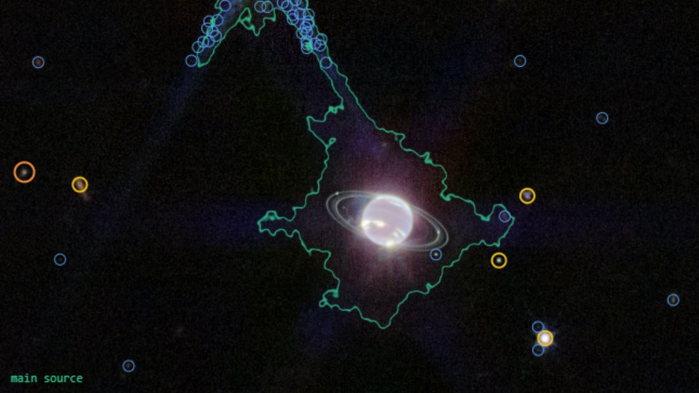
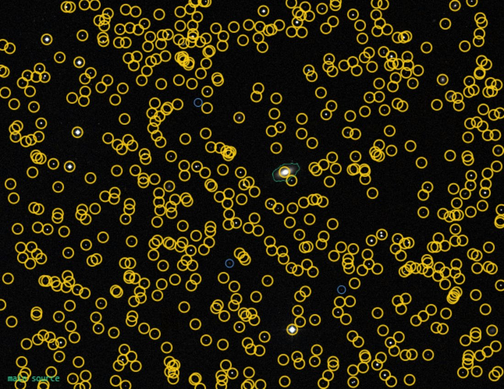
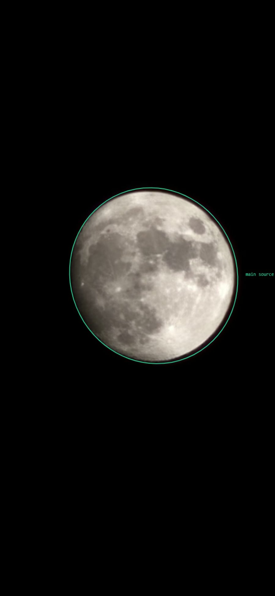

# Celestial Object Analyzer

Upload **any** photo of the sky — a phone snap of a bright dot, an amateur telescope
frame, or a JWST press image — and the app tells you what is in it, honestly.

Known objects are pinned **exactly** via astrometric plate solving and then every
detected source is named from live astronomical catalogs. When exact identification
is impossible, the app says so and falls back to an evidence-linked probabilistic
analysis — **it never invents a name**.

> **Status: work in progress.** The pipeline is functional end-to-end and heavily
> field-tested, but rough edges remain and the data setup is still manual.



## What makes it different

- **Never a wrong name.** Every identification path carries a measured acceptance
  gate calibrated on true/false distributions. When the evidence is insufficient the
  app answers "not determined" with the reasons — honest uncertainty is a feature.
- **Zero running cost.** Every backing service is free: a local astrometry.net
  engine (via WSL), SIMBAD/VizieR TAP, Gaia DR3, Pan-STARRS DR1, DES DR2, the
  Hubble Source Catalog (MAST), hips2fits, astropy ephemerides. No paid APIs,
  no LLM calls — the hypothesis engine is fully rule-based and inspectable.
- **Deterministic solving.** A local astrometry.net engine (WSL) replaces the
  nova.astrometry.net queue lottery; wide fields solve in seconds, and the narrow
  2-4 arcminute index tiles are fetched **on demand** per sky region (bounded
  LRU cache) instead of hosting the full 50 GB set.
- **Publisher astrometry for press images.** Space-telescope close-ups have no
  solvable star pattern, but the publishing archives (ESA/Hubble, ESA/Webb, ESO,
  NOIRLab) embed their own WCS in each image page's AVM metadata. A pixel-tight
  alignment onto the matching library reference inherits that WCS — a JWST frame
  of NGC 4254 went from 0 named objects to **3,739 of 5,705** this way, matched
  at sub-arcsecond offsets.
- **Deep catalog naming.** Solved frames are named through layered catalogs:
  SIMBAD → Gaia DR3 → Hubble Source Catalog (mag ~26) → Pan-STARRS/DES (r ~23-24),
  each with physically-motivated match tolerances and a magnitude-plausibility
  gate (a phone frame is never "matched" to a magnitude-19 star).
- **Appearance classes for non-solvable frames.** The Moon (including nightscapes
  and blood-moon eclipses), the Sun, Earth, ringed planets, aurorae, star trails,
  meteors vs. satellites vs. aircraft, the Milky Way band — each detected by
  measured geometric/photometric signatures, each with honest alternatives listed.
  A JWST Neptune frame is labeled "ringed planet (Saturn or an ice giant in
  infrared)" — because pixels alone genuinely cannot say which, and the app
  refuses to guess.

## Screenshots

| Solved star field (cold test, no prior data) | Phone photo of the Moon |
|---|---|
|  |  |

## How identification works (solver cascade)

1. **User hint** (object name + field width) if provided
2. **Visual identity** against a ~26k-image press library (embedding match, with
   pixel-level NCC verification and multi-reference support gates)
3. **Hinted local ASTAP** sweep
4. **Sky-tile quad vote** (local mini-astrometry over ~21k 2° DSS tiles)
5. **Pattern lock** onto reference fields with known WCS
6. **Publisher-WCS alignment** (press-avm; AVM metadata from the archives)
7. **Identity → rotation solve** (known position + size, Gaia-verified rotation sweep)
8. **Local astrometry.net engine** (WSL solve-field; wide + on-demand narrow indexes)
9. **nova.astrometry.net** as a bounded last resort (optional, your own free key)

Then: per-source naming from the catalog layers, ephemeris checks (EXIF time),
constellation context, photometry charts, and an annotated viewer where every
named source links to its SIMBAD/VizieR page.

## Setup

Tested on Windows 11 + Python 3.12+. Linux should work with minor path changes
(the engine then runs natively instead of via WSL).

```bash
python -m venv .venv
.venv/Scripts/pip install -r requirements.txt
copy config.example.json config.json   # then edit: add your free nova key (optional)
```

**Local astrometry engine (recommended — this is what makes solving deterministic):**

```bash
wsl --install -d Ubuntu --no-launch
wsl -d Ubuntu -u root -- apt update && wsl -d Ubuntu -u root -- apt install -y astrometry.net
```

Then download the wide-field index series 4107-4119 from
<http://data.astrometry.net/4100/> into `data/astrometry_index/` (~355 MB), and
add inside WSL `/etc/astrometry.cfg`: `add_path /opt/astro_index` + `autoindex`,
with `/opt/astro_index` symlinked to the index folder. The narrow 5000/5001
series is fetched automatically per-region at solve time (bounded cache).
Optional deeper series (5002-5006) improve 0.3-1° fields.

**Press-image library (optional — enables famous-image identification):**

```bash
python scripts/collect_press_archives.py   # harvests the four free archives (hours)
python scripts/build_visual_embeddings.py
python scripts/harvest_avm_wcs.py          # publisher WCS for the press-avm solver
python scripts/dedupe_press_refs.py
```

**Run:**

```bash
run.bat    # or: .venv/Scripts/python -m uvicorn app.main:app --port 8777
```

Open <http://127.0.0.1:8777>, drop a photo, press *Start analysis*.

## Tests

```bash
python scripts/test_pipeline.py     # 44-frame classification dump
python scripts/test_gate_cases.py   # 26 gated expectations (the arbiter)
python scripts/test_starid.py       # catalog naming unit tests
```

## Honest limitations (current)

- Close-ups narrower than ~0.05° of objects that have **no** press coverage
  cannot be solved (no star pattern, no reference) — the app says so instead of
  guessing. A user hint (`object name + field width`) often rescues these.
- Solar-system bodies are named exactly only when the photo carries EXIF capture
  time; messaging apps strip it (the app then says which candidates fit).
- Data setup is manual for now (see above); a one-shot bootstrap script is planned.

## Data & imagery credits

SIMBAD/VizieR (CDS, Strasbourg) · Gaia DR3 (ESA) · Pan-STARRS DR1 · DES DR2 ·
Hubble Source Catalog & MAST (STScI) · astrometry.net · hips2fits (CDS) ·
OpenNGC (CC-BY-SA-4.0) · press imagery from ESA/Hubble, ESA/Webb, ESO and
NOIRLab (CC BY 4.0) and NASA. Test images include NASA/ESA/ESO press material,
used for testing under their respective licenses.

## License

MIT — see [LICENSE](LICENSE).
